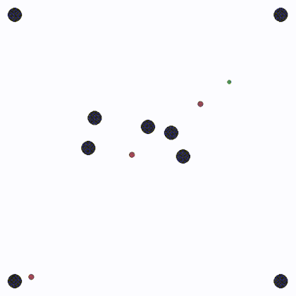

# Enhancing video game experience with play time training and tailoring of virtual opponents

When interacting with fictional environments, the users' sense of immersion can be broken when characters act in mechanical and predictable ways. The vast majority of AIs for such fictional characters, that control their actions, are statically scripted, and expert players can learn strategies that take advantage of this to easily win challenges that were intended to be hard. Games can also be too hard or too easy for certain players. Through the means of Reinforcement Learning, we propose a method to train adversaries in a simple environment for a game of tag from the PettingZoo library, exploring the possibility of such modern AIs to learn during the game. Our work aims towards a new concept of continuously learning AIs in video games, giving a framework to greatly increase adaptability of products to their users, and replayability of the challenges offered in them. We found that our solution allows the agents to learn during the game, but that more work should be done to achieve a model that tailors the behavior to the specific player. Nonetheless, this is an exploratory step towards more research on this new concept, which could have numerous applications in many genres of video games. 



## Setting up the environment

[Anaconda](https://www.anaconda.com/) is required to create dev environment.

- Create new environment for the project

  ```
  make create_environment
  make requirements
  ```

- Activate created or existing environment

  ```
  conda activate ./env
  ```

## Documentation

For an in-depth documentation of the commands.

- Run: `make documentation`
- Open: `docs/_build/html/index.html`

## Commands

The `Makefile` and `setup.py` contains the central entry points for common tasks related to this project.

- Makefile commands: Run `make help` to list all available commands.
- CLI commands: Run each command to get a list of its sub-commands.

| Command      | Description         |
| ------------ | ------------------- |
| `pipeline`   | Run entire pipeline |
| `world`      | Visualize world     |
| `adversary`  | Adversary tests     |
| `player`     | Player tests        |

- `adversary train` to run the training script
-  logging is done for each ray worker

### Common commands

```
adversary train -v -d "6x10 test"
player test ./models/example.pth -s random -v
results record ./logs/XXX_policy.pth -s evasive
```

### Windows Guide

```
conda env create --prefix ./$(ENV_DIR) --file environment.yml
conda activate ./env
pip install --no-deps -r requirements_freezed_linux_0304.txt
```
